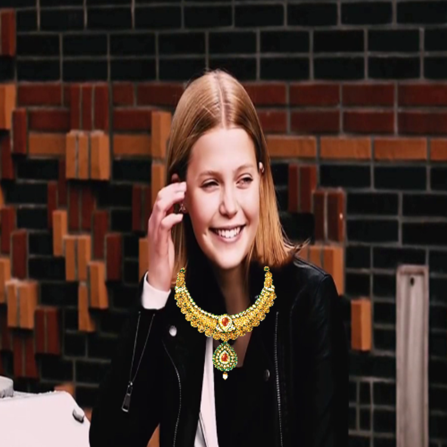
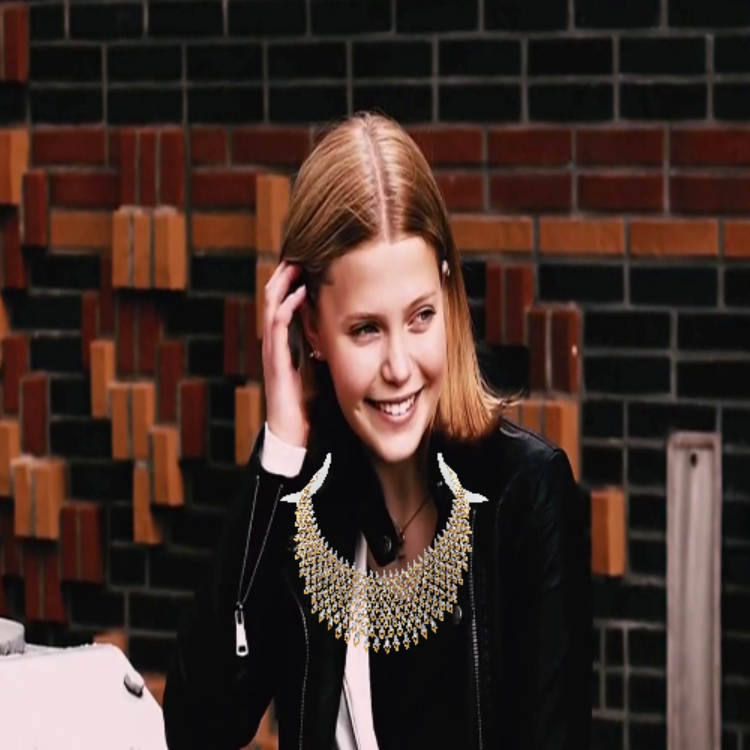

# ARJewelBox - Virtual Jewelry Trial System
ARJewelBox is a software application that allows users to try on jewelry virtually using augmented reality (AR) 
technology. By using a camera and a screen, the user can see themselves wearing different jewelry pieces in real-time, 
without the need to physically handle the actual jewelry. This technology can be used by jewelry retailers and 
e-commerce websites to enhance the online shopping experience and increase sales.

**You can use this source code for educational purposes till you provide the credits to the author. Also give a star and 
follow me if you like the project.**

### Screenshots
  |  |
:-------------------------:|:-------------------------: |
  |  |

### How to use
* This project is build over python & OpenCV; and tested on python 3.9.13 with the below dependencies. Don't forget to 
  install them before running the code.
  ```commandline
  pip install numpy==1.24.3
  pip install opencv-python==4.7.0.72
  ```
  Don't want to install python or any other packages, simply move to ```dist``` directory and 
  [download](https://github.com/AsutoshPati/ARJewelBox/tree/master/dist) ```Try-ARJewelBox.exe``` and run 
  the application.

  ### Functionalities
  * Upon execution of the code or executable, a loading screen will be displayed.
  * After the loading screen, the default webcam will open if the code is executed from the executable file. If the code 
    is executed directly, a test video (copyright free video has been provided) will begin playing.
  * Modifying the video source is possible through altering the code itself. Instructions detailing how to change the 
    video source will be provided at a later point in time.
  * When application is active; press
    * ESC - to quit the application
    * P/p - Previous jewellery
    * N/n - Next jewellery
    * S/s - Save / Capture image
    
  ### Using Source Code
  * By uncommenting the desired source option in the 
    [code](https://github.com/AsutoshPati/ARJewelBox/blob/ba4444a68b5a242f99da0e014ee440ff0e9f8725/main.py#LL36C1-L38C22), 
    the video source can be changed as per requirement.
    
    ```python
    VID_SOURCE = "USB_CAM"
    # VID_SOURCE = "FILE"
    # VID_SOURCE = "RTSP"
    ```
  * To use the **FILE** or **RTSP** source, the path or URL must be updated in the 
  [settings.json](https://github.com/AsutoshPati/ARJewelBox/blob/ba4444a68b5a242f99da0e014ee440ff0e9f8725/assets/configs/settings.json#LL2C1-L6C6) 
  file found within the ```configs``` folder under the ```assets``` directory.
    ```JSON
    {
        "USB_CAM": 0, -- default webcam
        "FILE": "assets/test_video/test.mp4",
        "RTSP": "rtsp://192.168.1.1:8080/out.h264"
    }
    ```
  * **To incorporate a new jewellery piece into the system**, first download a jewellery image with a transparent 
    background and place it within the ```jewellery``` folder located in the ```assets``` directory.
  * Next, the jewelry data must be added to the 
    [jewellery.json](https://github.com/AsutoshPati/ARJewelBox/blob/master/assets/configs/jewellery.json) file located 
    within the ```configs``` folder, under the ```assets``` directory.
  * Add the new jewellery data like shown below;
    ```JSON
    "jewel5": -- give a jewellery name
      {
        "path": "assets/jewellery/5.png", -- provide the new jewellery path from the root
        "x": 0, -- margin x
        "y": 0, -- margin y
        "dw": 1, -- scale factor width
        "dh": 1 -- scale factor height
      }
    ```
    **Margins & Scale factors can be found by hit and trial method**
  * After completing the above steps, re-run the program to access and use the newly added jewellery within the 
    application.

### License
[MIT License](https://github.com/AsutoshPati/ARJewelBox/blob/master/LICENSE)
